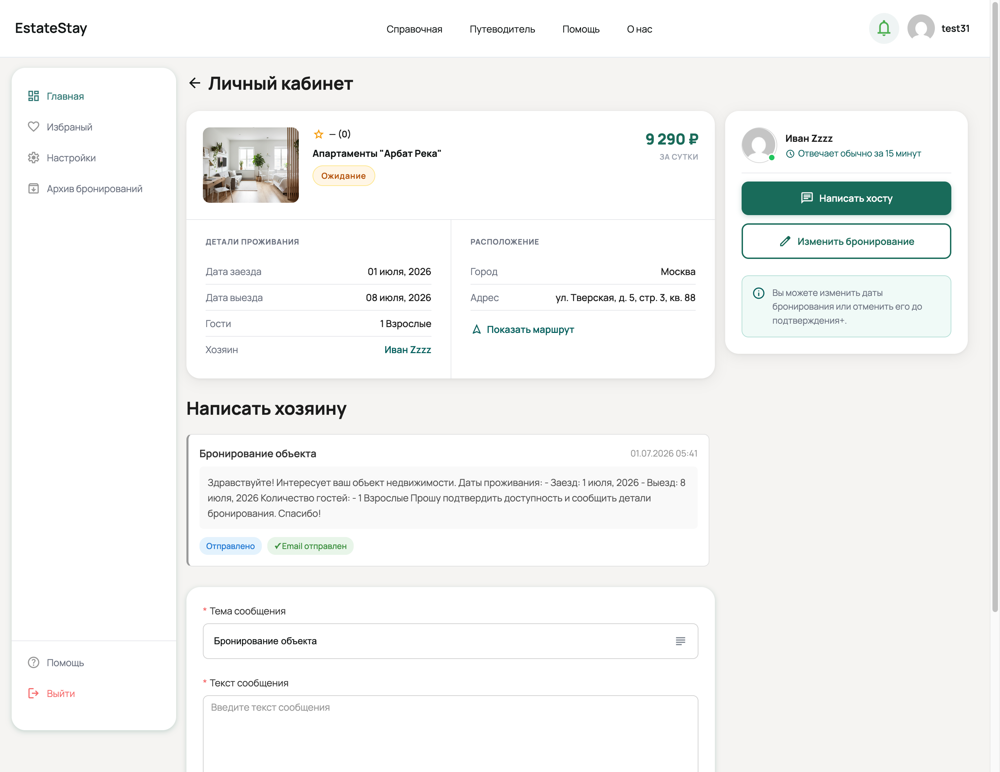
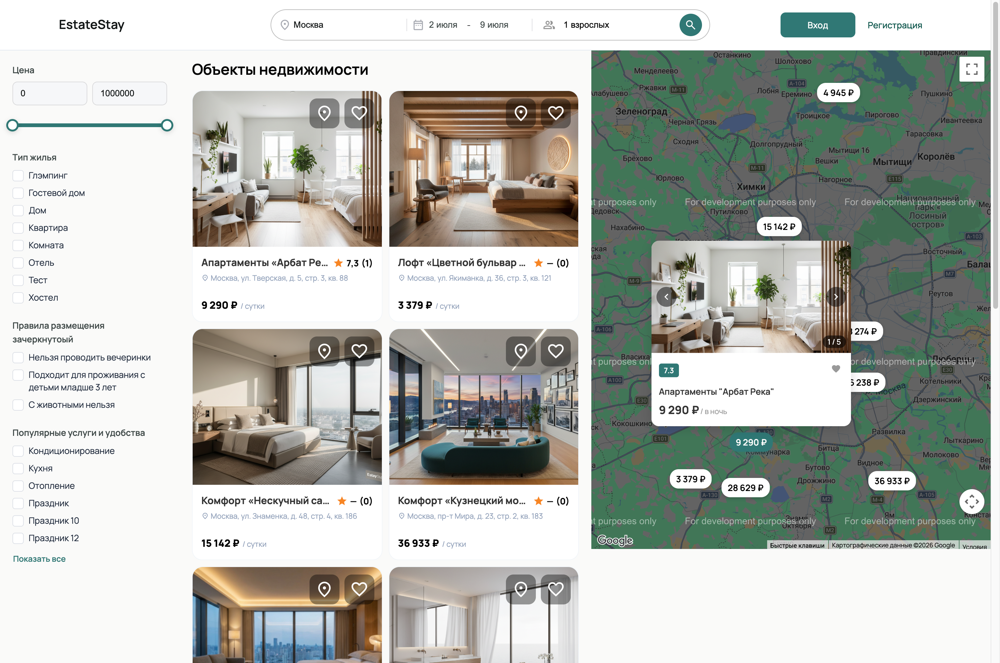

# Realty Theme MVP

WordPress-тема для сервиса аренды недвижимости с фокусом на взаимодействие между гостями и хозяевами.

## Описание

**Realty Theme MVP** — минимальный жизнеспособный продукт, позволяющий пользователям быстро найти недвижимость, связаться с владельцем и подать запрос на бронирование или длительное проживание. 

Тема обеспечивает:
- Простую регистрацию и вход для гостей
- Интуитивный поиск и фильтрацию объектов
- Личный кабинет с управлением запросами
- Быстрый контакт с хозяевами
- Отображение объектов на интерактивной карте

### Основные возможности

**- **Регистрация и вход** — быстрая регистрация через email
- **Каталог объектов** — поиск и фильтрация недвижимости с множеством параметров
- **Личный кабинет** — управление запросами и взаимодействие с хозяевами
- **Форма "Написать хозя**ину"** — отправка быстрых сообщений владельцу
- **Запрос длительного проживания** — отправка специального запроса с датами и условиями
- **Интерактивная карта** — отображение объектов на Google Maps

### Архитектура

- **Backend:** WordPress + PHP
- **Frontend:** Vue.js 3 (CDN-based) + Element Plus + Vuex
- **Управление данными:** Pods Framework для CPT
- **Сборка:** Webpack (SCSS + Vue компоненты)

## Демонстрация

📍 [Посетить демо-сайт](https://www.estatestay.ruszzz.ru/)

## Скриншоты

### Главное

### Личный кабинет

### Поиск и фильтрация

## Установка

### Требования

- WordPress 5.9+
- PHP 7.4+
- Node.js 14+ (для разработки)
- npm или yarn

### Шаги установки

1. **Загрузите тему в директорию WordPress:**
   - Распакуйте файлы темы в `wp-content/themes/realty-theme/`

2. **Активируйте тему в админ-панели WordPress:**
   - Перейдите в **Внешний вид → Темы**
   - Найдите **Realty Theme MVP** и нажмите **Активировать**

3. **Готово!** Тема активирована и готова к использованию.

## Планы развития (Roadmap)

### TODO
- **Адаптивный дизайн** — полная поддержка мобильных устройств
- **Улучшения и исправления** — оптимизация производительности, исправление найденных багов
- 
**Ограничение ответственности:**
Тема предоставляется "как есть" без каких-либо гарантий. Автор не несет ответственность за любые убытки или проблемы, вытекающие из использования этой темы.
